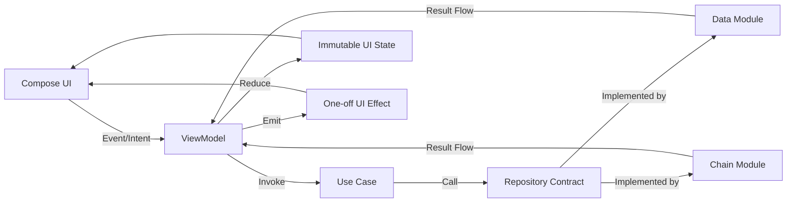

# Architecture

This project follows modular clean architecture and uses the **Horizon Pattern** as the UI-state orchestration model.

Reference article:
- [The Horizon Pattern: an evolution beyond classic MVI](https://medium.com/@mariorobertofortunato/the-horizon-pattern-an-evolution-beyond-classic-mvi-in-kotlin-apps-with-jetpack-compose-43be5281713a)

## High-Level Layers

- `app`: Compose UI, navigation, contracts, view models
- `domain`: models, business rules, use cases, repository interfaces
- `data`: repository implementations, persistence, shared network clients/factories
- `chain/*`: chain-specific protocol adapters, mappers, resolvers, repositories

## Dependency Direction Rules

Allowed dependencies:

- `app` -> `domain`, `data`, `chain/*`
- `data` -> `domain`
- `chain/*` -> `domain`, `data`
- `domain` -> no feature-layer dependency

Forbidden dependencies:

- `domain` importing `app`, `data`, or `chain/*`
- UI composables calling low-level network clients directly
- cross-chain coupling (`chain/solana` importing `chain/evm`, etc.)

## Horizon Pattern in This Project

Core principles:

- **Contract-first presentation**
  - each screen defines `Event`, `State`, and `Effect`
- **Directional flow**
  - UI emits events
  - ViewModel invokes use cases
  - repositories emit result streams
  - ViewModel reduces to immutable UI state
- **Separation of concerns**
  - business logic stays in use cases/repositories
  - presentation layer orchestrates and renders
- **Explicit side-effects**
  - navigation and one-shot UI actions are emitted as effects

## Horizon Event-to-Render Flow

## Runtime Model (Coroutines + Flow)

- use cases expose reactive streams where appropriate
- view models collect with lifecycle-aware scopes
- state updates are reduction-based and deterministic
- transient actions are modeled as effects, not persistent state

## State Contract Rules

For each presentation feature:

- `Event`: inputs entering the view model (user/system intents)
- `State`: immutable, render-ready snapshot
- `Effect`: one-shot outputs (navigation, snackbar, dialog trigger)

Constraints:

- state should remain serializable/replayable when possible
- state must not contain platform objects (`Context`, view refs)
- effects must not carry long-lived state

## Error Handling Strategy

- map transport/protocol failures at repository boundaries
- convert failures to domain-friendly error models
- view model maps failures to explicit state fields/effects
- UI renders explicit error states (no silent swallowing)

## Chain Module Responsibilities

Each `chain/*` module should contain:

- request builders and protocol DTOs
- DTO-to-domain mappers
- provider/network resolver logic
- repository adapters for chain-specific operations

Keep chain specifics isolated; shared abstractions belong in `domain` or `data`.

## Testing Guidance

- view model tests: deterministic state reduction per event sequence
- use case tests: business rules independent of UI framework
- mapper tests: nullability and protocol edge cases
- repository tests: error mapping and fallback behavior

## Extending the Architecture

When adding a new feature:

1. Define/extend domain model and contracts.
2. Implement use-case behavior in `domain`.
3. Implement repositories in `data` and/or `chain/*`.
4. Define presentation contract (`Event`, `State`, `Effect`).
5. Implement view model orchestration and reduction.
6. Bind UI to state/effects without embedding business logic.

When adding a new chain:

1. Add/extend `chain/<name>`.
2. Implement request builders + resolver logic.
3. Map protocol payloads to domain models.
4. Integrate via repository contracts and use cases.
